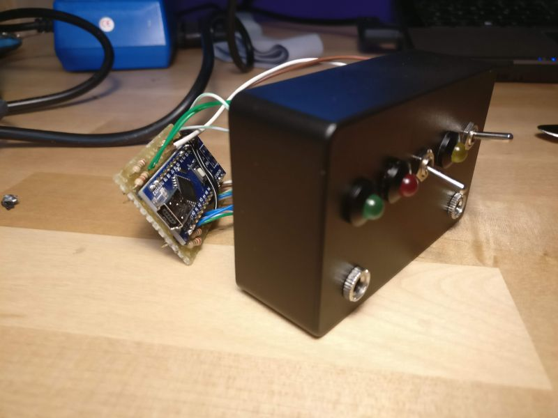
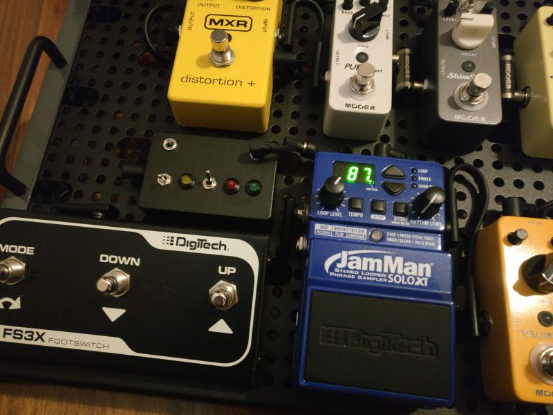

JamMan Arduino sync
===================

An Arduino project for syncing the JamMan Solo XT looper pedal (and compatible ones) to any analog clock/pulse input, for example from Korg Volca units, Arturia sequencers and synthesizers, Eurorack signals, etc.

[**Arduino code**][1] | [🗨️ **Mod Wiggler**][2]

[1]: main/main.ino
[2]: https://modwiggler.com/forum/viewtopic.php?t=206501

Features
--------

- Syncs JamMan looper pedals to Eurorack-like clock signals.
- Main LED lights up when clock input is present.
- Two additional LEDs blink following tempo (quarters and measures).
- The main LED blinks fast when incoming tempo is incompatible with JamMan (too fast or too slow).
- Optional switch for selecting pulses-per-quarter (disabled by default).
- Optional BPM display using a LTC-2727G (disabled by default).

Configuration
-------------

Parameters and pins configuration can be changed using the constants at the beginning of the code. Each one is commented.

Circuit
-------

To detect clock pulses with the highest reliability possible, Arduino's interrupts are used. The input signal is taken from an Eurorack-like clock output using a mono 3.5" jack, with the tip connected directly into the Arduino's interrupt pin and ground to GND. The output is a MIDI-like signal on a stereo jack into the JamMan sync input, connected this way:

- TX out (pin 1) -> 220ohm -> jack tip
- 3.3V -> 220ohm -> jack ring
- GND -> jack ground

The rest of the circuit is basic, just the usual resistors on LEDs pins and an on/off switch directly connected to the Arduino power source.

If the optional pulses-per-quarter switch is enabled, it must be connected to an analog pin in a way that it feeds 0V or 5V depending on the switch position. If the BPM display is enabled, check the LTC-2727G datasheet or adapt the code to a 3+ digits 7-segments display of choice.

Pictures
--------

 

Thanks
------

- <http://fuzzysynth.blogspot.com/2015/06/digitech-jam-man.html>
- <http://www.freestompboxes.org/viewtopic.php?f=1&t=26184>
- <https://github.com/Calde-github/Looperino/blob/master/Looper.ino>
